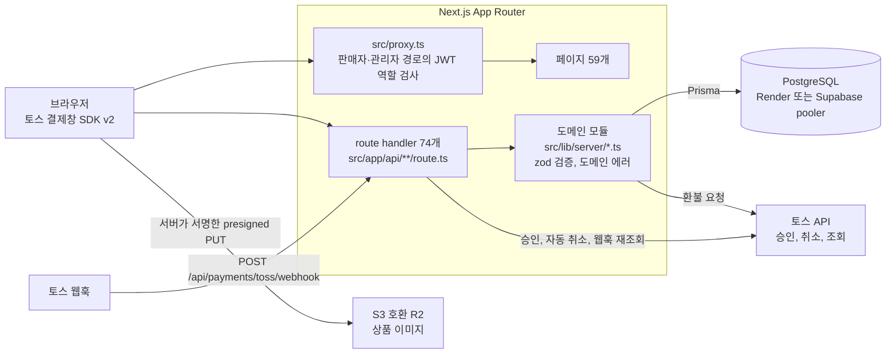
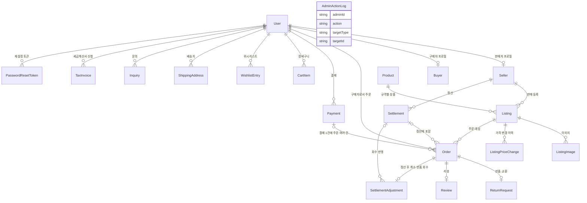

<div align="center">

# tire-b2b-commerce

**타이어 B2B 마켓플레이스**

판매자와 구매자 모두 승인제로 운영하는 타이어 B2B 오픈마켓. 주문, 토스페이먼츠 결제, 부분환불, 반품·교환, 판매자 정산, 세금계산서까지 다룬다.

      

[핵심 기술 과제](#핵심-기술-과제와-해결) · [아키텍처](#아키텍처) · [실행 방법](#실행-방법) · [회고](#회고와-개선-과제)

</div>

| 기간 | 역할 | 규모 | 테스트 | 배포 |
|:---:|:---:|:---:|:---:|:---:|
| 2026.07 – 2026.09 | 1인 · 설계·구현·검증·배포 전담 | 원본 커밋 127 · 페이지 59 · route handler 74 | 자동화 테스트 없음 · 타입 검사 · 린트 · PGlite 하네스 | Vercel + Supabase, Render |

> [!IMPORTANT]
> **문제** — 구매자와 판매자가 모두 사업자인 거래에서는 결제 1건에 여러 주문이 묶이고 취소·환불·정산이 이어져, 동시 요청과 외부 결제 API 실패가 돈과 재고 상태를 쉽게 어긋나게 한다.
>
> **해결** — 외부 결제 API는 트랜잭션 밖에서 호출하고, 상태 전이는 기대 상태를 조건으로 건 `updateMany`로 처리하며, 금액은 서버가 정한다. 자동 환불이 실패하면 기록을 남겨 사람이 이어받게 했다.
>
> **내 역할** — 1인 프로젝트로 설계, 구현, 검증, 배포를 전담했다(원본 커밋 127개, 2026-07-23 ~ 2026-09-01).

## 프로젝트 개요

### 배경

이 서비스는 타이어를 등록해 파는 사업자(판매자)와 주문해 사는 사업자(구매자)를 잇는 B2B 오픈마켓이다. 구매자와 판매자 모두 사업자등록번호를 포함한 사업자 정보로 가입하고, 관리자가 승인해야 거래에 참여할 수 있다. 관리자는 승인과 정지, 상품 검수, 주문과 반품 처리, 판매자 정산 지급을 맡는다.

사업자 간 거래라서 세금계산서 신청과 발행 기록이 결제 조건에 가깝다. 또 결제 1건에 여러 판매자의 주문이 묶일 수 있어서, 취소와 환불과 정산이 결제가 아니라 주문 단위로 갈라진다.

### 해결한 문제

- 토스 승인은 끝났는데 DB 반영이 실패한 경우를 실패 지점별 상태로 나누어, 돈이 나갔는데 시스템이 모르는 상태를 최소화했다.
- 외부 결제 API 호출을 DB 트랜잭션 밖으로 빼고, 주문 단위 멱등키로 재시도가 이중 환불이 되지 않게 했다.
- 부분환불을 자동화하면서 과다환불을 막고, 자동 환불이 실패한 결제는 사람이 이어받도록 기록을 남겼다.
- 서명이 없는 토스 웹훅을 요청 바디를 믿지 않는 방식으로 받았다.
- 상태 전이 경합을 조건부 갱신으로 막고, 가격과 배송비는 서버가 정하게 했다.

## 팀 구성과 내 역할

| 항목 | 내용 |
| --- | --- |
| 기간 | 2026-07-23 ~ 2026-09-01 |
| 인원 | 1명 — 설계·구현·검증·배포 전담 |
| 원본 커밋 | 127개 |
| 내 역할 | 요구사항 정리, 설계, 구현, 결제 경로의 실제 토스 테스트 결제 검증, 배포(Vercel + Supabase, Render), 운영 가이드 작성 |

구현 과정에서 AI 코딩 도구(Claude)를 활용했다. 요구사항 정리, 설계 결정, 코드 리뷰, 실제 토스 테스트 결제와 Postgres 시나리오 검증, 운영 가이드 작성은 직접 했다.

공개용으로 정리하면서 커밋 히스토리를 새로 시작했다. 원본 저장소 커밋 127개(2026-07-23 ~ 2026-09-01). 문서 속 커밋 해시는 원본 저장소 기준이다.

## 주요 기능

- **가입과 승인**: 구매자와 판매자 모두 가입 후 관리자가 승인해야 거래할 수 있다. 사업자등록번호는 체크섬으로 검증하고 unique로 중복 가입을 막는다([`src/lib/business-reg-number.ts`](src/lib/business-reg-number.ts)).
- **상품 탐색**: 서버 페이징 검색, 필터, 정렬.
- **구매**: 장바구니, 위시리스트, 배송지 주소록, 다건 결제. 미결제 주문은 30분 뒤 자동 만료되고 재고가 복원된다.
- **취소와 사후 처리**: 취소와 자동 부분환불, 반품·교환, 구매확정, 리뷰, 문의.
- **판매자**: 상품 등록(이미지는 presigned URL로 업로드), 발송과 송장 입력, 반품 처리, 정산 조회.
- **관리자**: 구매자·판매자 승인과 정지, 상품 검수, 주문·반품 처리, 정산 지급, 세금계산서 처리, 문의 답변.
- **계정**: 운영자가 매개하는 비밀번호 재설정, 탈퇴 시 개인정보 파기, 비밀번호 변경 시 기존 세션 무효화.
- **보안과 운영**: 보안 헤더와 CSP(Report-Only), 헬스체크(`/api/health`).
- **규모**: route handler 74개, 페이지 59개, Prisma 마이그레이션 18개.

## 아키텍처



- route handler는 모두 `runtime = "nodejs"`인 얇은 핸들러다. 요청을 zod로 파싱하고 도메인 모듈에 위임한 뒤 도메인 에러를 응답으로 바꾼다. 비즈니스 로직은 두지 않는다.
- `src/lib/server/*.ts`는 도메인마다 하나씩 있는 모듈이다. 각 모듈이 자기 zod 스키마와 도메인 에러 클래스를 가진다.
- 인증이 필요한 핸들러는 `requireRole`, `requireSeller`, `requireAdmin` 중 하나로 시작한다. [`src/proxy.ts`](src/proxy.ts)는 `/seller`, `/admin` 경로의 JWT 역할만 검사하므로 서버 측 가드를 대체하지 않는다.
- 규칙의 전문은 [`docs/architecture.md`](docs/architecture.md)에 있다.

## 기술 스택과 선택 이유

| 영역 | 선택 | 선택 이유 |
| --- | --- | --- |
| 앱 구조 | Next.js 16 App Router, React 19, TypeScript 5 | 페이지와 API를 한 프로젝트에서 다룬다. route handler는 얇게 두고 로직은 도메인 모듈에 모은다([`docs/architecture.md`](docs/architecture.md)). |
| 인증 | NextAuth 4 (Credentials, JWT 세션 8시간) | JWT는 발급한 뒤에 무효화할 수 없다. 그래서 `getSession()`이 호출마다 DB를 다시 읽어 정지·탈퇴 사용자를 즉시 차단하고, 비밀번호 변경 이전에 발급된 토큰도 거부한다([`src/lib/server/auth.ts`](src/lib/server/auth.ts)). |
| 검증 | zod 4 | 도메인 모듈마다 요청 스키마를 두고 검증 실패를 응답으로 매핑한다. |
| DB | PostgreSQL, Prisma 6 | 스키마 변경은 새 마이그레이션 파일로만 하고, 기존 행이 어떻게 되는지 마이그레이션마다 명시하고 백필한다. |
| 결제 | Toss Payments SDK v2, API 개별 연동 키 | 계정에 발급된 키가 API 개별 연동 키(`test_ck_`/`test_sk_`)라서 v2 `payment().requestPayment()` 흐름을 쓴다. 결제위젯 키(`test_gck_`/`test_gsk_`)를 넣으면 결제창이 뜨지 않는다. |
| 이미지 저장 | S3 호환 스토리지(Cloudflare R2), presigned PUT | R2가 presigned POST를 지원하지 않는다. PUT 서명에 Content-Length를 묶어 선언한 크기와 실제 업로드 크기가 다르면 거부한다([`#L116`](src/lib/server/storage.ts#L116), [`#L147`](src/lib/server/storage.ts#L147)). |
| 배포 | Vercel(icn1) + Supabase(서울, transaction pooler), Render 병행 | 서버리스는 요청마다 커넥션을 새로 열어 풀러가 필요하고, 마이그레이션은 직결 주소(`DIRECT_URL`)로 적용한다. Render 배포도 유지한다([`render.yaml`](render.yaml), [`vercel.json`](vercel.json)). |

그 밖에 Tailwind CSS 4, Radix UI, bcryptjs, AWS SDK v3(S3 클라이언트와 presigner)를 쓴다.

## 핵심 기술 과제와 해결

| # | 과제 | 핵심 기법 |
|:-:|---|---|
| 1 | [외부 결제 API는 트랜잭션 밖에서 호출](#1-외부-결제-api는-트랜잭션-밖에서-호출) | 트랜잭션에서는 DB 쓰기만 · 커밋한 뒤 토스 취소 API 호출 · 주문 단위 멱등키(`order-cancel-refund:<orderId>`) |
| 2 | [부분환불 자동화와 과다환불 방지](#2-부분환불-자동화와-과다환불-방지) | 로컬 잔액을 계산해 클램프 · 마지막 주문은 `cancelAmount` 생략 · 자동 환불 실패 표식을 sticky로 남기기 |
| 3 | [결제 승인 후 DB 반영 실패 복구 상태 설계](#3-결제-승인-후-db-반영-실패-복구-상태-설계) | 실패 지점별로 상태 분리 · HTTP 202 `PAYMENT_CONFIRM_PENDING_RECONCILIATION` 응답 · 승인 사실조차 기록하지 못하면 토스 자동 취소 |
| 4 | [서명 없는 웹훅의 안전한 처리](#4-서명-없는-웹훅의-안전한-처리) | 공유 비밀값을 `timingSafeEqual`로 비교 · 비밀값이 없으면 503 · 바디를 믿지 않고 토스 API에서 다시 읽기 |
| 5 | [상태 전이 경합 방지와 서버 결정 가격](#5-상태-전이-경합-방지와-서버-결정-가격) | 기대 상태를 `where`에 건 `updateMany` · 반환된 `count` 검사 · 가격과 배송비를 서버가 결정 |

### 1. 외부 결제 API는 트랜잭션 밖에서 호출

- **문제**: Postgres는 HTTP 호출을 롤백하지 못한다. 트랜잭션 안에서 토스 취소 API를 부르면, 환불은 실제로 나갔는데 뒤이은 쿼리 실패나 타임아웃으로 주문은 취소되지 않고 재고도 복원되지 않는 상태가 생긴다.
- **해결**: `cancelOrder`의 트랜잭션에서는 DB 쓰기만 한다. 주문 취소, 재고 복원, "환불할 돈이 있다"는 사실(`Payment.refundRequiredAt`, `refundReason`, `refundAmount`)을 먼저 커밋한다. 커밋한 뒤에 토스 취소 API를 호출하고 결과를 따로 기록한다. 재시도가 이중 환불이 되지 않도록 주문 단위의 안정적인 멱등키(`order-cancel-refund:<orderId>`)를 쓴다.
- **근거 코드**: [`cancelOrder`](src/lib/server/orders.ts#L762), [`Idempotency-Key` 헤더](src/lib/server/orders.ts#L614), [멱등키 값](src/lib/server/orders.ts#L708)
- **검증/결과**: 실제 토스 테스트 결제(3건 묶음 6,000원)에서 1건 취소와 순차 취소를 돌려, 멱등키가 주문별로 분리되고 과다환불과 잔액 누락이 0인 것을 확인했다([`docs/verification.md`](docs/verification.md)).

### 2. 부분환불 자동화와 과다환불 방지

- **문제**: 결제 1건에 주문이 여러 건 묶여 있어 한 건만 취소해도 그 금액만 환불해야 한다. 자동화하면 이미 나간 돈을 다시 취소 요청하는 과다환불이 생길 수 있고, 일부 환불이 실패한 결제가 이후의 성공한 취소에 가려질 수 있다.
- **해결**: 취소되는 주문마다 그 주문 금액을 `cancelAmount`로 토스에 제출하되, 결제에 기록된 `refundAmount`로 로컬 잔액을 계산해 그 이상 나가지 않게 클램프한다. 결제에 남은 마지막 주문을 취소할 때는 `cancelAmount`를 생략해 토스의 남은 잔액 전체를 취소한다. 그래야 콘솔에서 결제가 PARTIAL_CANCELED가 아닌 CANCELED가 되고, 앞선 부분취소 중 실패한 금액도 함께 회수된다. 토스는 보유 잔액 이상을 돌려주지 않으므로 과다환불은 없다. 자동 환불이 실패하면 `AUTO_REFUND_FAILED_NEEDS_MANUAL_TOSS_CANCEL` 표식을 sticky로 남겨서, 이후 다른 주문의 취소가 성공해도 `refundRequiredAt`이 지워지지 않게 한다.
- **근거 코드**: [로컬 잔액 클램프](src/lib/server/orders.ts#L986), [`settleOrderRefundViaToss`](src/lib/server/orders.ts#L687), [`cancelAmount` 생략](src/lib/server/orders.ts#L616), [`docs/operations.md`](docs/operations.md)
- **검증/결과**: 실제 토스 테스트 결제에서 순차 취소가 합계 6,000원, 과다환불 0으로 끝나는 것을 확인했다. 잔액 전체 취소로 바꾼 것은 실제 테스트 결제에서 전액 환불된 6,000원 주문이 콘솔에 부분취소로 남는 것을 관찰했기 때문이다(코드 주석). 토스는 잔액이 0이어도 PARTIAL_CANCELED를 돌려주므로 응답 상태를 그대로 쓰지 않고, 남은 활성 주문이 0건이라는 자체 판단으로 결제를 CANCELED로 바꾼다. 주문별 환불 원장이 없어 관리자 배지 금액이 누계로 보이는 한계는 운영 가이드에 기록했다.

### 3. 결제 승인 후 DB 반영 실패 복구 상태 설계

- **문제**: 토스 승인(카드 청구)은 끝났는데 그 결과를 DB에 반영하는 단계가 실패하면, 돈은 나갔는데 시스템은 그 사실을 모르는 상태가 생긴다. 이때 구매자에게 재결제를 유도하면 이중 결제가 된다.
- **해결**: 실패 지점별로 상태를 나눴다. 결제 완료 처리 트랜잭션이 실패하면 승인 사실만이라도 먼저 기록하고(`ORDER_STATUS_SYNC_FAILED`) HTTP 202 `PAYMENT_CONFIRM_PENDING_RECONCILIATION`으로 응답해 재결제를 유도하지 않는다. 승인 사실조차 기록하지 못하면 토스에 자동 취소를 요청하고, 성공하면 `DB_SAVE_FAILED_AUTO_CANCELED`로 남긴다. 자동 취소까지 실패한 경우에만 `TOSS_PAYMENT_CONFIRM_UNRECOVERABLE` 로그를 남기고 사람이 개입한다. 동시에 들어온 다른 승인 요청이 이미 결제를 완료했다면 취소하지 않고 성공으로 응답한다.
- **근거 코드**: [`ORDER_STATUS_SYNC_FAILED` 기록](src/app/api/payments/toss/confirm/route.ts#L273), [202 응답](src/app/api/payments/toss/confirm/route.ts#L292), [자동 취소 후 기록](src/app/api/payments/toss/confirm/route.ts#L336), [UNRECOVERABLE 로그](src/app/api/payments/toss/confirm/route.ts#L344)
- **검증/결과**: 상태별 운영자 조치를 [`docs/operations.md`](docs/operations.md) 2절에 정리했다. 이 분기들은 [`docs/verification.md`](docs/verification.md)의 실물 검증 목록에 들어 있지 않다.

### 4. 서명 없는 웹훅의 안전한 처리

- **문제**: 토스 웹훅에는 서명 헤더나 HMAC이 없어서, 요청 바디를 믿으면 위조된 웹훅으로 결제 상태를 바꿀 수 있다. 그렇다고 웹훅을 받지 않으면 결제 직후 브라우저를 닫아 승인 요청이 실행되지 않은 결제나 토스 콘솔에서 직접 한 취소가 DB에 반영되지 않는다.
- **해결**: 등록한 웹훅 URL의 쿼리에 심은 공유 비밀값(`TOSS_WEBHOOK_SECRET`)을 `timingSafeEqual`로 비교하고, 비밀값이 설정되어 있지 않으면 항상 503을 반환한다. 실제 방어선은 비밀값이 아니라 바디를 믿지 않는 것이다. 바디는 "어느 결제를 다시 볼지"에만 쓰고, 결제 상태와 금액과 취소 여부는 `TOSS_SECRET_KEY`로 인증한 서버 간 호출로 토스 API에서 다시 읽는다. 비밀값이 유출되어 위조 요청이 오더라도 존재하지 않거나 이 앱이 모르는 결제를 가리키면 아무 일도 일어나지 않는다.
- **근거 코드**: [토스 API 재조회 방식(파일 머리 주석)](src/app/api/payments/toss/webhook/route.ts#L66), [`verifyWebhookSecret`](src/app/api/payments/toss/webhook/route.ts#L186), [비밀값이 없으면 503](src/app/api/payments/toss/webhook/route.ts#L203)
- **검증/결과**: 공식 문서에 페이로드 형식이 없어 방어적으로 파싱했고, 실제 웹훅 페이로드로는 아직 검증하지 못했다. 형식이 다르면 오류 없이 무시되는 구조라서 개선 과제로 남겼다([`docs/verification.md`](docs/verification.md)).

### 5. 상태 전이 경합 방지와 서버 결정 가격

- **문제**: 같은 주문에 취소, 발송, 구매확정, 자동 만료가 동시에 들어오면 상태 컬럼에 대한 단순 `update`는 경합이 된다. 요청 바디의 단가나 배송비를 그대로 저장하면 클라이언트가 금액을 정하게 된다.
- **해결**: 상태 전이는 기대하는 현재 상태를 `where`에 건 `updateMany`로 수행하고, 반환된 `count`를 검사해 다른 요청이 먼저 상태를 바꿨다면 실패시킨다. `src/lib/server/*.ts`에 `updateMany` 호출이 24곳 있다. 미결제 주문은 결제 기한(30분)이 지나면 주문 목록을 읽는 시점에 만료시키고 재고를 복원한다. 가격은 트랜잭션 안에서 `Listing`을 읽어 서버가 정하고, 배송비는 판매자 정책과 상품 소계로 서버가 계산한다.
- **근거 코드**: [`expireStaleUnpaidOrders`](src/lib/server/orders.ts#L225), [`pricing.ts`](src/lib/server/pricing.ts), `src/lib/server/*.ts`의 `updateMany` 사용처
- **검증/결과**: PGlite 하네스로 배송완료 주문이 취소 가능해지던 회귀를 잡았다. 배포 DB에서는 미결제 주문이 로그인 시점에 자동 만료되고 재고가 복원되는 것을 확인했다([`docs/verification.md`](docs/verification.md)).

## 데이터 모델 요약



- 구매자 관련 데이터(주문, 결제, 장바구니, 위시리스트, 배송지)는 `Buyer`가 아니라 `User`에 연결된다. `Buyer`와 `Seller`는 승인 상태 같은 역할별 프로필을 담는다.
- 상품은 규격(제조사, 모델, 폭, 편평비, 림)이 같은 `Product` 하나에 판매자별 `Listing`이 붙는 구조다. 재고, 가격, 상태는 `Listing`이 가진다.
- 주문 상태는 한글 문자열이고 [`src/lib/order-status.ts`](src/lib/order-status.ts)에 정의된다. 배송 상태(`ShippingStatus`)는 enum이다.
- 주문은 배송지와 기본 배송비를 주문 시점 값으로 스냅샷하고, 정산 금액도 확정 시점 값으로 저장한다.
- 리뷰, 반품·교환 요청, 정산 후 회수는 주문 1건당 최대 1건이다(`orderId` unique).
- `AdminActionLog`는 다른 테이블과 외래키로 연결되지 않는 독립 로그다.

## 실행 방법

Node.js와 PostgreSQL 연결 문자열이 필요하다(`render.yaml`은 Node 22.14.0을 쓴다).

```bash
npm install
# .env.local 과 .env 에 아래 환경변수를 채운다
npx prisma migrate deploy
SEED_DEMO_USERS=true npm run db:seed
npm run dev
```

Next.js는 `.env.local`을, Prisma CLI는 `.env`를 읽으므로 `DATABASE_URL`은 두 파일에 모두 있어야 한다. 값은 저장소에 커밋하지 않는다.

<details>
<summary><b>환경 변수 표 펼치기</b></summary>

| 변수 | 용도 |
| --- | --- |
| `DATABASE_URL` | 런타임 쿼리용 Postgres 주소. Supabase에서는 transaction pooler 주소(포트 6543)에 `?pgbouncer=true&connection_limit=1`을 붙인다 |
| `DIRECT_URL` | 마이그레이션용 직결 주소(포트 5432). 풀러가 없으면 `DATABASE_URL`과 같은 값을 쓴다 |
| `NEXTAUTH_SECRET` | 세션 JWT 서명용 비밀값 |
| `NEXTAUTH_URL` | 앱의 공개 주소. 로컬은 `http://localhost:3000` |
| `TOSS_CLIENT_KEY` | 토스 API 개별 연동 클라이언트 키(test 키). 서버가 결제 준비 응답으로 브라우저에 전달한다 |
| `TOSS_SECRET_KEY` | 토스 API 개별 연동 시크릿 키(test 키). 서버의 결제 승인·취소·조회에만 쓴다 |
| `TOSS_WEBHOOK_SECRET` | 웹훅 URL 쿼리에 심는 공유 비밀값. 없으면 웹훅이 503을 반환한다 |
| `S3_*` (선택) | 상품 이미지 presigned 업로드용 스토리지 설정. 없으면 이미지 업로드만 503이 된다 |
| `TRUSTED_PROXY_HOPS` | 앞단 리버스 프록시 개수(Render, Vercel 모두 1). 레이트리밋이 클라이언트 IP를 고르는 데 쓴다 |
| `SEED_*` | 시드 스크립트 옵션. 데모 계정은 `SEED_DEMO_USERS=true`일 때만 만들고 `NODE_ENV=production`에서는 거부한다 |

</details>

데모 계정의 로그인 ID는 `admin`, `buyer`, `seller`이다. 비밀번호는 `SEED_ADMIN_PASSWORD`, `SEED_DEMO_BUYER_PASSWORD`, `SEED_DEMO_SELLER_PASSWORD`로 정하고, 지정하지 않으면 개발 환경에서만 코드 기본값을 쓴다. 시드 스크립트는 타이어 카탈로그([`src/lib/mockData.ts`](src/lib/mockData.ts))도 함께 넣는다.

결제 화면은 구매자로 로그인해 주문을 만들고 주문 목록에서 결제하기를 누르면 열린다. 본인 토스 계정의 API 개별 연동 test 키가 필요하다. 웹훅 등록, 이미지 스토리지, Vercel + Supabase 배포 절차는 [`docs/deployment.md`](docs/deployment.md)에 있다.

## 테스트

- 자동화 테스트와 테스트 러너는 없다.
- 정적 검사는 `npx tsc --noEmit`와 `npx eslint .`이고, 둘 다 오류 없이 통과해야 한다.
- 돈이 오가는 경로는 PGlite(WASM Postgres) 하네스로 마이그레이션 SQL과 앱 코드를 실제 Postgres 위에서 돌려 보고, 실제 토스 테스트 결제로도 확인했다. 결과와 재현 방법은 [`docs/verification.md`](docs/verification.md)에 있다.
- 빌드, 타입체크, 린트를 통과하고도 실제 DB 데이터에서 틀린 변경이 여러 번 나왔기 때문에, 이 통과는 기준선일 뿐 검증의 증거로 보지 않았다.

## 폴더 구조

<details>
<summary><b>폴더 트리 펼치기</b></summary>

```text
tire-b2b-commerce/
├── docs/               # 아키텍처, 배포, 운영, 검증 문서
├── prisma/
│   ├── schema.prisma   # 데이터 모델
│   ├── migrations/     # 마이그레이션 18개
│   └── seed.ts         # 데모 계정(옵트인)과 타이어 카탈로그 시드
├── public/             # 배너, 브랜드 이미지, 로고
├── src/
│   ├── app/            # App Router 페이지 59개
│   │   └── api/        # route handler 74개
│   ├── components/     # 공용 UI 컴포넌트
│   ├── lib/            # 공용 모듈, 타입, 상태 값
│   │   └── server/     # 도메인 모듈(orders, cart, payout, returns 등)
│   ├── proxy.ts        # /seller, /admin 경로의 JWT 역할 검사
│   └── types/
├── next.config.ts      # 보안 헤더와 CSP(Report-Only)
├── render.yaml         # Render 배포 설정
├── vercel.json         # Vercel 리전(icn1)
└── package.json
```

</details>

### 관련 문서

- [`docs/architecture.md`](docs/architecture.md): 아키텍처와 불변 규칙. 소스 주석의 "AGENTS.md" 참조가 가리키는 문서다.
- [`docs/operations.md`](docs/operations.md): 운영 가이드. 환불 실패 처리, 결제 확인 실패 상태, 웹훅, 배포 주의사항. 소스 주석의 "README의 운영 가이드" 참조가 가리키는 문서다.
- [`docs/deployment.md`](docs/deployment.md): 토스 테스트 키, 웹훅 설정, DB 시딩, 이미지 업로드, Vercel + Supabase 배포.
- [`docs/verification.md`](docs/verification.md): 실물 검증 기록과 PGlite 검증 하네스 재현법.

## 회고와 개선 과제

**회고**

- AI가 만든 변경 12건 중 6건이 빌드·타입·린트는 통과하지만 실제 DB 데이터에서 틀렸다. 그래서 diff를 직접 읽고, 돈이 걸린 경로는 실제 Postgres로 시나리오를 돌려 확인했다.
- 틀린 유형은 두 가지였다. 하나는 기존 행을 고려하지 않은 마이그레이션(백필 누락)이고, 다른 하나는 지시를 과하게 적용한 수정이다. "부분환불을 환불완료로 표시하지 말라"는 지시가 성공한 부분환불까지 계속 "처리중"으로 보이게 만든 경우가 그 예다.
- 앞의 교훈은 마이그레이션마다 기존 행의 처리를 명시하고 백필한다는 규칙으로 남겼다([`docs/architecture.md`](docs/architecture.md)).

**개선 과제**

- **테스트 스위트 도입**: 지금은 타입체크, 린트, 수동 시나리오 검증뿐이다. 돈이 걸린 경로부터 자동화 테스트로 옮겨야 한다.
- **레이트리미터**: [`src/lib/server/rateLimit.ts`](src/lib/server/rateLimit.ts)의 인메모리 구현은 서버리스에서 인스턴스마다 따로 동작해 효과가 약하다. 공유 저장소 기반으로 교체해야 한다.
- **환불 원장**: 주문별 환불 성공 여부를 기록하는 원장이 없다. 그래서 관리자 배지 금액이 결제 단위 취소 금액의 누계로 보이고, 아직 환불되지 않은 금액과 다를 수 있다.
- **CSP 전환**: 지금은 Report-Only다. 실제 결제에서 문서에 없는 토스 도메인이 나와 `*.tosspayments.com`, `*.toss.im` 와일드카드로 바꿨고, 라이브 키로 한 번 더 확인한 뒤 enforcing으로 전환해야 한다([`next.config.ts`](next.config.ts)).
- **법정 표시와 약관**: 푸터의 법정 표시사항이 더미값이고 약관 4종은 초안이다. 서비스 개시 전에 실제 값과 법무 검토가 필요하다.
- **실물 검증 공백**: 웹훅 실제 페이로드, 할부 결제와 할부 부분취소, 이미지 업로드는 아직 실물로 검증하지 못했다([`docs/verification.md`](docs/verification.md)).
- **알림 채널**: 이메일이나 SMS 같은 알림 채널이 연결되어 있지 않다. [`src/lib/server/notify.ts`](src/lib/server/notify.ts)의 기본 구현은 아무것도 전송하지 않는다.

---

<div align="center">

[다른 프로젝트 보기](https://github.com/pyobonboy) · [pyobon07@naver.com](mailto:pyobon07@naver.com)

</div>
